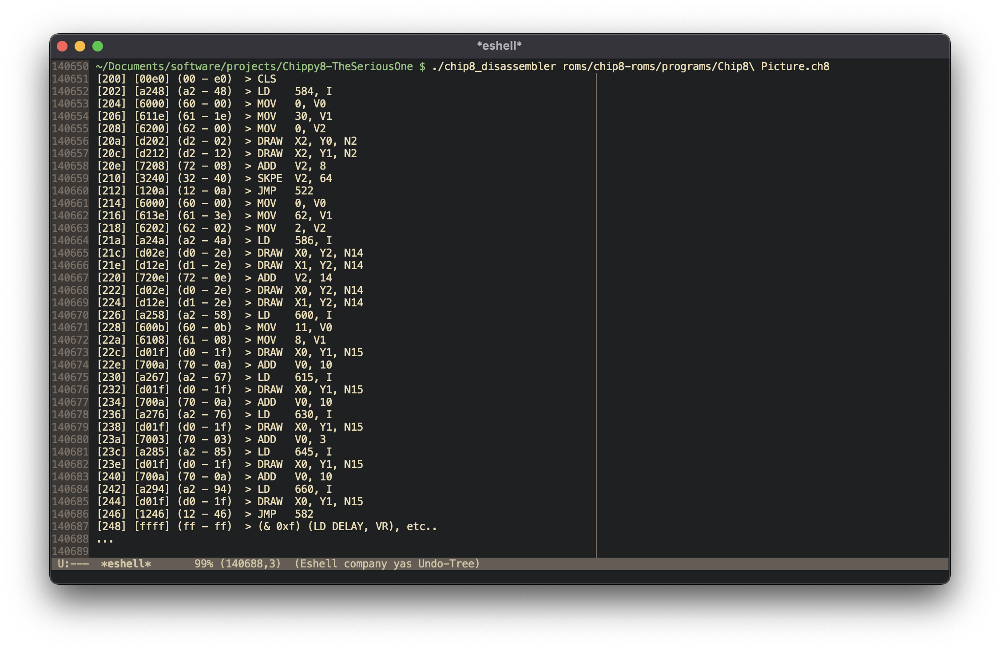

# Chippy8

**_This is currently a work in progress_**

A (**soon-to-be**) complete Chip8 emulator written in C.

**As of right now, only the disassembler is fully functional.**

The emulator is able to run some of the roms. 
The IBM Logo runs without a fatal crash.

## How to compile
The included makefile compiles two separate binaries, the emulator and the disassembler.

By default, running make will compile both of them.

### Makefile Rules

#### [no rule]
>	Compiles both emulator and disassembler.

#### disas
>	Compiles the disassembler.

#### disas-clean
>	Cleans up the disassembler: deletes the executable and the object files.

#### emu
>	Compiles the emulator

#### emu-clean
>	Cleans up the emulator stuff: deletes the executable and the object files.

## The Disassembler

This executable takes the path to a chip8 ROM disassembles it into a pseudo-ASM.
**The mnemonic is currently subject to change**. It was bullshit I came up with as a placeholder.

>	*usage: ./chip8_disassemble [rom_file]*

## The Emulator

This executable takes the path to a chip8 ROM and emulates it.
**The emulator is not entirely functional as of yet**.

>	*usage: ./chip8_emulator [rom_file]*

