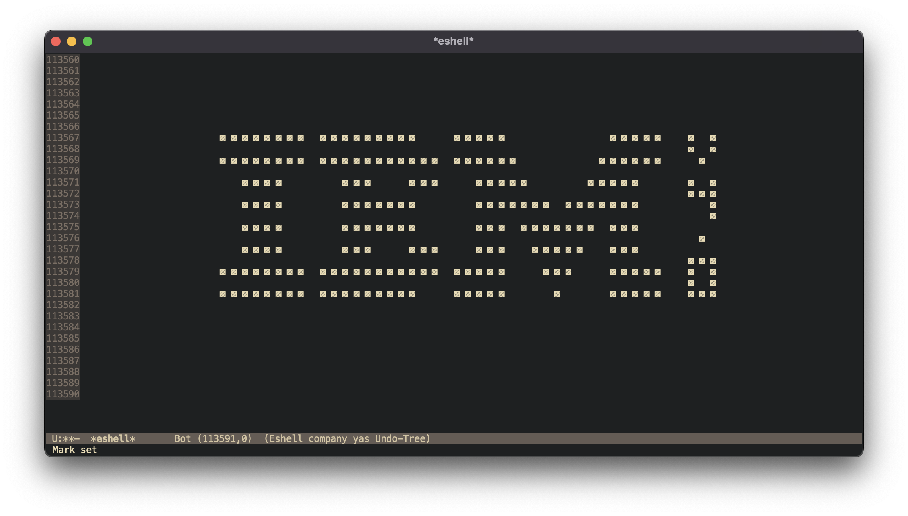

# Chippy8

A Chip8 emulator written in C.

The emulator is able to run various roms without a crash.
Timers and keypad have not been emplemented (yet).

## How to compile
The included makefile compiles two separate binaries, the emulator and the disassembler.

By default, running make will compile both of them.

## The Emulator

This executable takes the path to a chip8 ROM and emulates it.
**The emulator does not fully pass common test roms as of yet**.

>	*usage: ./chip8_emulator [rom_file]*

## The Disassembler

This executable takes the path to a chip8 ROM disassembles it into a pseudo-ASM.

>	*usage: ./chip8_disassemble [rom_file]*

### Makefile Rules

#### [no rule]
>	Compiles both emulator and disassembler.

#### disas
>	Compiles the disassembler.

#### disas-clean
>	Cleans up the disassembler: deletes the executable and the object files.

#### emu
>	Compiles the emulator

#### emu-debug
>	starts a debug session with lldb.

#### emu-debug-build
>	builds a debug executable (prints info as rom's executed).

#### emu-clean
>	Cleans up the emulator stuff: deletes the executable and the object files.
